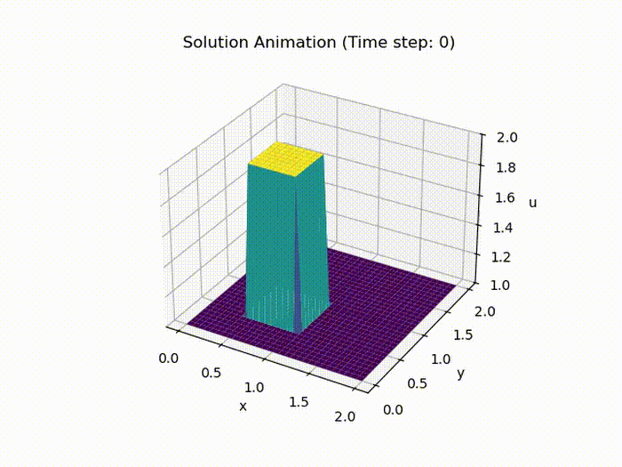

# CFD Solver

Small Python CFD learning project evolving toward a Navier-Stokes solver, currently focused on 1D and 2D finite-difference models.

## Current status

Currently implemented:

* 1D and 2D linear advection
* 1D and 2D nonlinear convection
* 1D and 2D diffusion
* 1D and 2D Burgers equation
* uniform grid generation
* hat-function and Cole-Hopf initial conditions
* explicit finite-difference solvers
* solution plots and animations

Planned next steps:

* validation of the 2D solvers
* improved testing and documentation
* incompressible Navier-Stokes components

## Example visualizations

### 2D diffusion



### Validation: 1D diffusion vs heat equation


## Implemented models

The current solvers advance:

* the 1D linear advection equation:

  du/dt + c du/dx = 0

  using an explicit upwind finite-difference scheme.

* the 2D linear advection equation:

  du/dt + c du/dx + c du/dy = 0

  using an explicit upwind finite-difference scheme.

* the 1D nonlinear convection equation:

  du/dt + u du/dx = 0

  using an explicit upwind finite-difference scheme.

* the 2D nonlinear convection equations:

  du/dt + u du/dx + v du/dy = 0

  dv/dt + u dv/dx + v dv/dy = 0

  using an explicit upwind finite-difference scheme.

* the 1D diffusion equation:

  du/dt = ν d²u/dx²

  using an explicit central finite-difference scheme.

* the 2D diffusion equation:

  du/dt = ν (d²u/dx² + d²u/dy²)

  using an explicit central finite-difference scheme.

* the 1D Burgers equation:

  du/dt + u du/dx = ν d²u/dx²

  using an explicit upwind scheme for the convective term and a central scheme for the diffusive term.

* the 2D Burgers equations:

  du/dt + u du/dx + v du/dy = ν (d²u/dx² + d²u/dy²)

  dv/dt + u dv/dx + v dv/dy = ν (d²u/dx² + d²u/dy²)

  using an explicit upwind scheme for the convective terms and a central scheme for the diffusive terms.

## Validation

This project includes validation workflows that compare numerical finite-difference solutions with analytical reference solutions.

For the 1D diffusion equation, the numerical solver is validated against a Fourier-based analytical solution of the heat equation.

For the 1D Burgers equation, the numerical solver is validated against the analytical Cole-Hopf solution.

These comparisons are used to assess solver correctness and visualize agreement between numerical and analytical results.

## Run

```bash
python run_advection_1d.py
python run_advection_2d.py
python run_convection_1d.py
python run_convection_2d.py
python run_diffusion_1d.py
python run_diffusion_1d_vs_heat.py
python run_diffusion_2d.py
python run_burgers_equation_1d.py
python run_burgers_equation_1d_vs_cole_hopf.py
python run_burgers_equation_2d.py
```
