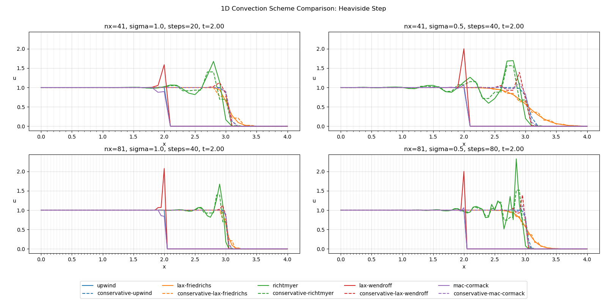
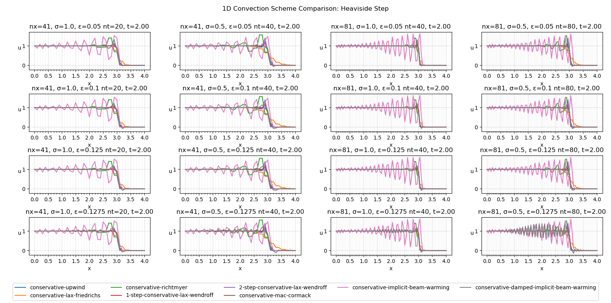
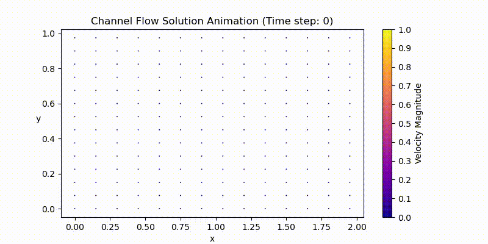

# CFD Solver

Python finite-difference and finite-volume CFD project for rebuilding canonical incompressible-flow solvers from first principles. The focus is on numerical schemes, pressure-velocity coupling, boundary conditions, validation against analytical solutions, and visualisation of flow fields.

## Implemented solvers and validation cases

Currently implemented:

* 1D linear advection with upwind, leapfrog, Lax-Friedrichs, and Lax-Wendroff finite-difference schemes
* 1D linear advection with an explicit upwind finite-volume method
* 2D linear advection
* 1D nonlinear convection / inviscid Burgers with upwind, Lax-Friedrichs, Richtmyer, one-step and two-step Lax-Wendroff, MacCormack, and implicit Beam-Warming schemes, including conservative flux-form variants
* 1D nonlinear convection with an explicit finite-volume method
* 2D nonlinear convection
* 1D and 2D diffusion, including a 1D finite-volume diffusion solver
* 1D and 2D Burgers equation, including a 1D finite-volume Burgers solver
* 2D Laplace equation
* 2D Poisson equation with configurable source terms
* 2D lid-driven cavity flow using a pressure Poisson solve
* 2D pressure-driven channel flow with periodic x-boundaries
* uniform grid generation
* hat-function, Heaviside-style step, and Cole-Hopf initial conditions
* explicit finite-difference time-marching solvers
* iterative pressure/potential solves using L1 convergence or fixed iteration limits
* contour, surface, quiver, and animation visualizations

## Project structure

```text
core/config.py              finite-difference simulation dataclasses
core/config_fvm.py          finite-volume simulation dataclasses
core/setup/                 finite-difference grids, time steps, and initial conditions
core/setup/fvm/             finite-volume mesh, time-stepping, and initial-condition helpers
core/numerics/              finite-difference solvers
core/numerics/fvm/          finite-volume 1D solvers
core/analytical/            analytical reference solutions
post_processing/            contour, surface, quiver, and animation helpers
run_*.py                    executable examples
```

## Example visualizations

### 1D nonlinear convection scheme comparison



### 1D inviscid Burgers scheme comparison



### 2D diffusion


### Validation: 1D diffusion vs heat equation


### 2D lid-driven cavity flow


### 2D pressure-driven channel flow



## Implemented models

The current solvers model:

* the 1D linear advection equation:

  du/dt + c du/dx = 0

  using selectable explicit finite-difference schemes: upwind, leapfrog, Lax-Friedrichs, and Lax-Wendroff.

  A finite-volume variant is also included, using an explicit upwind scheme on a cell-centered mesh with conservative flux updates and a CFL-based time-step constraint.

* the 2D linear advection equation:

  du/dt + c du/dx + c du/dy = 0

  using an explicit upwind finite-difference scheme.

* the 1D nonlinear convection equation:

  du/dt + u du/dx = 0

  and its conservative form:

  du/dt + d(u^2 / 2)/dx = 0

  using selectable explicit schemes: upwind, Lax-Friedrichs, Richtmyer, one-step Lax-Wendroff, two-step Lax-Wendroff, and MacCormack. Conservative flux-form variants are included for shock propagation, along with implicit Beam-Warming and damped implicit Beam-Warming variants for inviscid Burgers experiments.

  A finite-volume variant is also included, using an explicit upwind scheme on a cell-centered mesh with conservative flux updates and a CFL-based time-step constraint.

* the 2D nonlinear convection equations:

  du/dt + u du/dx + v du/dy = 0

  dv/dt + u dv/dx + v dv/dy = 0

  using an explicit upwind finite-difference scheme.

* the 1D diffusion equation:

  du/dt = ν d²u/dx²

  using an explicit central finite-difference scheme.

* the 1D diffusion equation:

  du/dt = nu d^2u/dx^2

  using an explicit central finite-difference scheme. A 1D finite-volume diffusion variant is also included and can be compared against the heat-equation reference solution.

* the 1D Burgers equation:

  du/dt + u du/dx = nu d^2u/dx^2

  with the conservative convective form:

  du/dt + d(u^2 / 2)/dx = nu d^2u/dx^2

  using an explicit upwind scheme for the finite-difference convective term and a central scheme for the diffusive term. A 1D finite-volume Burgers variant is also included, using conservative flux updates for the convective term and diffusive fluxes for viscosity, and can be compared against the Cole-Hopf analytical solution.

* the 2D Burgers equations:

  du/dt + u du/dx + v du/dy = ν (d²u/dx² + d²u/dy²)

  dv/dt + u dv/dx + v dv/dy = ν (d²u/dx² + d²u/dy²)

  using an explicit upwind scheme for the convective terms and a central scheme for the diffusive terms.

* the 2D Laplace equation:

  d²p/dx² + d²p/dy² = 0

  solved iteratively with finite differences until an L1 target is reached.

* the 2D Poisson equation:

  d²p/dx² + d²p/dy² = b

  solved iteratively with configurable positive and negative source terms.

* the 2D incompressible lid-driven cavity flow problem:

  du/dt + u du/dx + v du/dy = -1/rho dp/dx + nu (d^2u/dx^2 + d^2u/dy^2)

  dv/dt + u dv/dx + v dv/dy = -1/rho dp/dy + nu (d^2v/dx^2 + d^2v/dy^2)

  d^2p/dx^2 + d^2p/dy^2 = b

  using explicit finite differences for the velocity equations and an iterative pressure Poisson solve.

* the 2D incompressible pressure-driven channel flow problem:

  du/dt + u du/dx + v du/dy = -1/rho dp/dx + nu (d^2u/dx^2 + d^2u/dy^2) + F

  dv/dt + u dv/dx + v dv/dy = -1/rho dp/dy + nu (d^2v/dx^2 + d^2v/dy^2)

  d^2p/dx^2 + d^2p/dy^2 = b

  using explicit finite differences for the velocity equations, an iterative pressure Poisson solve, periodic boundary conditions in x, and no-slip walls at y = 0 and y = Ly.

## Validation and numerical experiments

This project includes validation workflows that compare numerical finite-difference solutions with analytical reference solutions.

For the 1D diffusion equation, finite-difference and finite-volume solvers can be compared against a Fourier-based analytical solution of the heat equation.

For the 1D Burgers equation, finite-difference and finite-volume solvers can be compared against the analytical Cole-Hopf solution.

The 1D convection scheme comparison script visualizes conservative and non-conservative schemes on a Heaviside step problem, comparing grid resolution and CFL number effects. This highlights numerical diffusion, dispersive oscillations near shocks, and conservative-form shock propagation.

The inviscid Burgers scheme comparison script studies conservative shock-capturing schemes, including implicit Beam-Warming and damped implicit Beam-Warming, across grid resolutions, CFL numbers, and artificial-damping coefficients.

These comparisons are used to assess solver correctness and visualize agreement between numerical and analytical results.

## Roadmap

* Benchmark lid-driven cavity profiles against reference data.
* Validate pressure-driven channel flow against analytical Poiseuille behaviour.
* Add regression tests for boundary conditions and pressure-source terms.
* Add convergence studies for grid spacing and time-step sensitivity.
* Add limiters or artificial viscosity for oscillation control near shocks.
* Add regression tests for 1D convection scheme updates.
* Validate inviscid Burgers shock speeds against Rankine-Hugoniot predictions.
* Study damping sensitivity for implicit Beam-Warming schemes.

## Run

```bash
python run_advection_1d.py
python run_advection_1d_fvm.py
python run_advection_1d_scheme_comparison.py
python run_advection_2d.py
python run_convection_1d.py
python run_convection_1d_fvm.py
python run_convection_1d_scheme_comparison.py
python run_inviscid_burgers_scheme_comparison.py
python run_convection_2d.py
python run_diffusion_1d.py
python run_diffusion_1d_fvm.py
python run_diffusion_1d_vs_heat.py
python run_diffusion_1d_fvm_vs_heat.py
python run_diffusion_2d.py
python run_burgers_equation_1d.py
python run_burgers_equation_1d_fvm.py
python run_burgers_equation_1d_vs_cole_hopf.py
python run_burgers_equation_1d_fvm_vs_cole_hopf.py
python run_burgers_equation_2d.py
python run_laplace_2d.py
python run_poisson_2d.py
python run_cavity_flow.py
python run_channel_flow.py
```