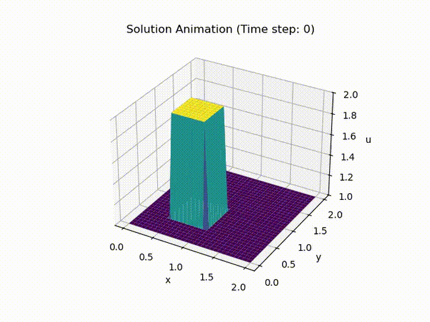
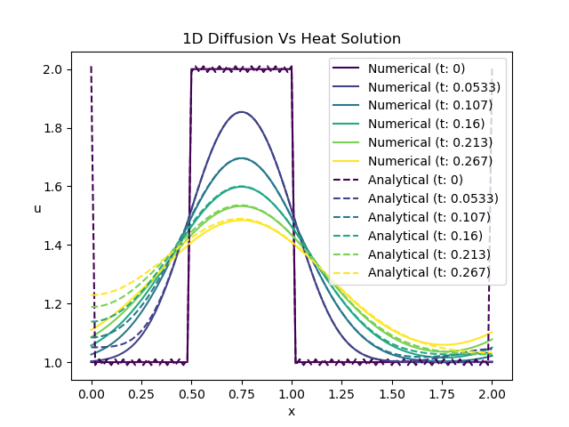
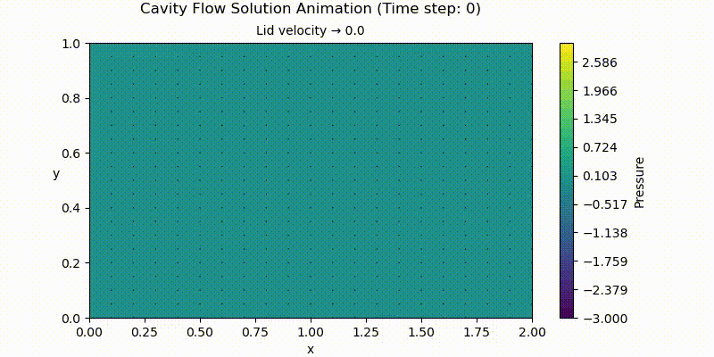

# CFD Solver

Python finite-difference CFD project for rebuilding canonical incompressible-flow solvers from first principles. The focus is on numerical schemes, pressure-velocity coupling, boundary conditions, validation against analytical solutions, and visualisation of flow fields.

## Implemented solvers and validation cases

Currently implemented:

* 1D and 2D linear advection
* 1D and 2D nonlinear convection
* 1D and 2D diffusion
* 1D and 2D Burgers equation
* 2D Laplace equation
* 2D Poisson equation with configurable source terms
* 2D lid-driven cavity flow using a pressure Poisson solve
* 2D pressure-driven channel flow with periodic x-boundaries
* uniform grid generation
* hat-function and Cole-Hopf initial conditions
* explicit finite-difference time-marching solvers
* iterative pressure/potential solves using L1 convergence or fixed iteration limits
* contour, surface, quiver, and animation visualizations

## Project structure

```text
core/config.py              simulation dataclasses
core/setup/                 grids, time steps, initial conditions
core/numerics/              finite-difference solvers
core/analytical/            analytical reference solutions
post_processing/            contour, surface, quiver, and animation helpers
run_*.py                    executable examples
```

## Example visualizations

### 2D diffusion



### Validation: 1D diffusion vs heat equation



### 2D lid-driven cavity flow



### 2D pressure-driven channel flow


## Implemented models

The current solvers model:

* the 1D linear advection equation:

  du/dt + c du/dx = 0

  using an explicit upwind finite-difference scheme.

* the 2D linear advection equation:

  du/dt + c du/dx + c du/dy = 0

  using an explicit upwind finite-difference scheme.

* the 1D nonlinear convection equation:

  du/dt + u du/dx = 0

  using an explicit upwind finite-difference scheme.

* the 2D nonlinear convection equations:

  du/dt + u du/dx + v du/dy = 0

  dv/dt + u dv/dx + v dv/dy = 0

  using an explicit upwind finite-difference scheme.

* the 1D diffusion equation:

  du/dt = ν d²u/dx²

  using an explicit central finite-difference scheme.

* the 2D diffusion equation:

  du/dt = ν (d²u/dx² + d²u/dy²)

  using an explicit central finite-difference scheme.

* the 1D Burgers equation:

  du/dt + u du/dx = ν d²u/dx²

  using an explicit upwind scheme for the convective term and a central scheme for the diffusive term.

* the 2D Burgers equations:

  du/dt + u du/dx + v du/dy = ν (d²u/dx² + d²u/dy²)

  dv/dt + u dv/dx + v dv/dy = ν (d²u/dx² + d²u/dy²)

  using an explicit upwind scheme for the convective terms and a central scheme for the diffusive terms.

* the 2D Laplace equation:

  d²p/dx² + d²p/dy² = 0

  solved iteratively with finite differences until an L1 target is reached.

* the 2D Poisson equation:

  d²p/dx² + d²p/dy² = b

  solved iteratively with configurable positive and negative source terms.

* the 2D incompressible lid-driven cavity flow problem:

  du/dt + u du/dx + v du/dy = -1/rho dp/dx + nu (d^2u/dx^2 + d^2u/dy^2)

  dv/dt + u dv/dx + v dv/dy = -1/rho dp/dy + nu (d^2v/dx^2 + d^2v/dy^2)

  d^2p/dx^2 + d^2p/dy^2 = b

  using explicit finite differences for the velocity equations and an iterative pressure Poisson solve.

* the 2D incompressible pressure-driven channel flow problem:

  du/dt + u du/dx + v du/dy = -1/rho dp/dx + nu (d^2u/dx^2 + d^2u/dy^2) + F

  dv/dt + u dv/dx + v dv/dy = -1/rho dp/dy + nu (d^2v/dx^2 + d^2v/dy^2)

  d^2p/dx^2 + d^2p/dy^2 = b

  using explicit finite differences for the velocity equations, an iterative pressure Poisson solve, periodic boundary conditions in x, and no-slip walls at y = 0 and y = Ly.

## Validation

This project includes validation workflows that compare numerical finite-difference solutions with analytical reference solutions.

For the 1D diffusion equation, the numerical solver is validated against a Fourier-based analytical solution of the heat equation.

For the 1D Burgers equation, the numerical solver is validated against the analytical Cole-Hopf solution.

These comparisons are used to assess solver correctness and visualize agreement between numerical and analytical results.

## Roadmap

* Benchmark lid-driven cavity profiles against reference data.
* Validate pressure-driven channel flow against analytical Poiseuille behaviour.
* Add regression tests for boundary conditions and pressure-source terms.
* Add convergence studies for grid spacing and time-step sensitivity.

## Run

```bash
python run_advection_1d.py
python run_advection_2d.py
python run_convection_1d.py
python run_convection_2d.py
python run_diffusion_1d.py
python run_diffusion_1d_vs_heat.py
python run_diffusion_2d.py
python run_burgers_equation_1d.py
python run_burgers_equation_1d_vs_cole_hopf.py
python run_burgers_equation_2d.py
python run_laplace_2d.py
python run_poisson_2d.py
python run_cavity_flow.py
python run_channel_flow.py
```
